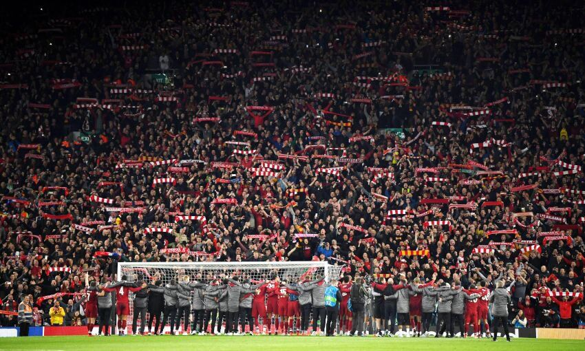
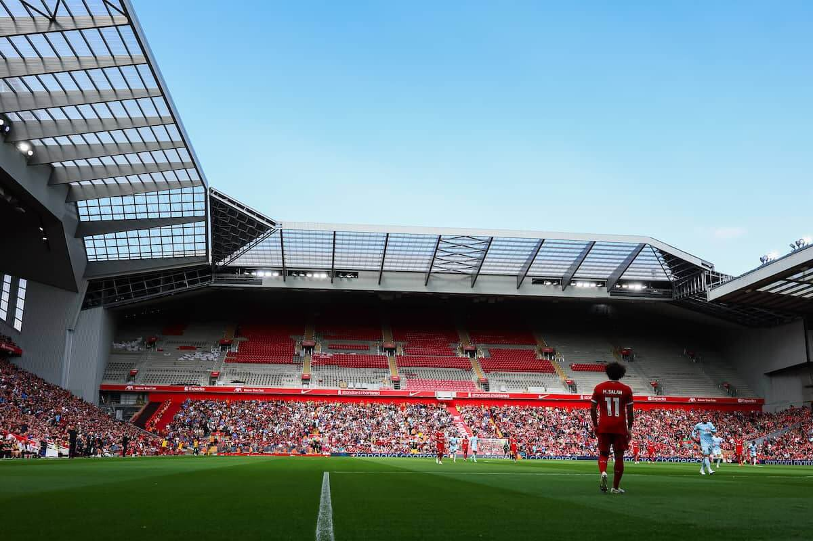
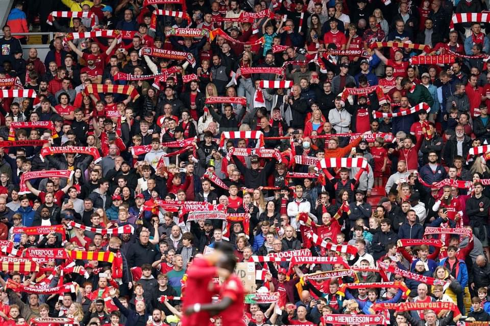

```{r ,global_options, include=FALSE}
library(knitr)
opts_chunk$set(message=FALSE, warning=FALSE, tidy.opts = list(width.cutoff=60))
suppressPackageStartupMessages(library(ggthemes))
suppressPackageStartupMessages(library(plotly))
suppressPackageStartupMessages(library(tidyverse))
suppressPackageStartupMessages(library(shiny))
suppressPackageStartupMessages(library(flexdashboard))
suppressPackageStartupMessages(library(pander))
suppressPackageStartupMessages(library(DT))
suppressPackageStartupMessages(library(ggvis))
suppressPackageStartupMessages(library(viridis))
suppressPackageStartupMessages(library(readxl))
suppressPackageStartupMessages(library(ggplotlyExtra))

epl=data.frame(read.csv("matches.csv", header=TRUE))
liv<-epl[epl$Team=="Liverpool",]
```

# Introduction

## Column

Liverpool is a professional football club based in Everton, England. The team took part in the 2023/24 Premier League season and managed a 3rd place finish under Jurgen Klopp, which was his final season in charge at the club. The Reds secured qualification for the new UEFA Champions League - 2024/25 campaign. This dashboard looks at the club's on-the-pitch performance in the English top flight division.

### Jurgen Klopp

```{r, fig.align="top", out.width="10%"}

```

## Column

### 

```{r, fig.align="top", out.width="10%"}

```


### 

```{r, fig.align="top", out.width="10%"}

```


# Players {data-orientation="rows"}

## Row

```{r}
## PLAYERS' DATASET
sheets<-excel_sheets("Soccer-Stats-Premier-League-2023-2024_Final_20240610.xlsx")
players<-data.frame(read_excel("Soccer-Stats-Premier-League-2023-2024_Final_20240610.xlsx",
                               sheet = sheets[4]))

# dim(players) # 746 rows by 27 columns
# Checking for duplicates  
# players[duplicated(players), ]  # No duplicates found
# Checking for missing values
# players[!complete.cases(players), ] # 572 cases with NAs  
#players<-players[complete.cases(players), ]# 487 complete cases
players1<-players[,c(2,7,9,10,12,20,23,24,25,26)]

# DATA TYPE CONVERTION
players1$Name<-factor(players1$Name)
players1$Team<-factor(players1$Team)
players1$Position<-factor(players1$Position)
```

### Registered players

```{r}
players %>% 
  filter(Team == "Liverpool") %>% 
  count() %>% 
  valueBox(color="#00B2A9")
```

### Goalkeepers

```{r}
players %>% 
  filter(Team == "Liverpool",
         Position == "Goalkeeper") %>% 
  count() %>% 
  valueBox(color="#00B2A9")
```

### Defenders

```{r}
players %>% 
  filter(Team == "Liverpool",
         Position == "Defender") %>% 
  count() %>% 
  valueBox(color = "#00B2A9")
```

### Midfielders

```{r}
players %>% 
  filter(Team == "Liverpool",
         Position == "Midfielder") %>% 
  count() %>% 
  valueBox(color="#00B2A9")
```

### Forwards

```{r}
players %>% 
  filter(Team == "Liverpool",
         Position == "Forward") %>% 
  count() %>% 
  valueBox(color="#00B2A9")
```

### Average age (years)

```{r}
players %>% 
  filter(Team == "Liverpool") %>% 
  summarise(round(mean(Age),0)) %>% 
  valueBox(color="#00B2A9")
```

## Row {.tabset .tabset-fade}

### Goalkeepers

```{r}
players %>% 
  filter(Team == "Liverpool",
         Position == "Goalkeeper") %>% 
  select(Citizenship, Name, Jersey) %>% 
  pander()
```

### Defenders

```{r}
players %>% 
  filter(Team == "Liverpool",
         Position == "Defender") %>% 
  select(Citizenship, Name, Jersey) %>% 
  pander()
```

### Midfielders

```{r}
players %>% 
  filter(Team == "Liverpool",
         Position == "Midfielder") %>% 
  select(Citizenship, Name, Jersey) %>% 
  pander()
```

### Forwards

```{r}
players %>% 
  filter(Team == "Liverpool",
         Position == "Forward") %>% 
  select(Citizenship, Name, Jersey) %>% 
  pander()
```

# Outcomes

## Column

### Home

```{r}
cat("Wins","[%]")
#liv %>% 
  #filter(Venue == "Home" & Result=="W") %>% 
  #summarise(win.pct.h=n()*100/19) %>% 
  gauge(78.95, min=0,max=100,symbol="%",
        gaugeSectors(success = c(80,100),
                     warning =c(40,79),
                     danger = c(0,39)))

```

### 

```{r}
cat("Draws","[%]")
#liv %>% 
  #filter(Venue == "Home" & Result=="D") %>% 
  #summarise(draw.pct.h=n()*100/19) %>% 
  gauge(15.79, min=0,max=100,symbol="%")

```

### 

```{r}
cat("Losses","[%]")
#liv %>% 
  #filter(Venue == "Home" & Result=="L") %>% 
  #summarise(loss.pct.h=n()*100/19) %>% 
  gauge(5.26, min=0,max=100,symbol="%",
        gaugeSectors(success = c(0,39),
                     warning =c(40,79),
                     danger = c(80,100)))

```

## Column

### Away

```{r}
cat("Wins","[%]")
#liv %>% 
  #filter(Venue == "Away" & Result=="W") %>% 
  #summarise(win.pct.a=n()*100/19) %>% 
  gauge(47.37, min=0,max=100,symbol="%",
        gaugeSectors(success = c(80,100),
                     warning =c(40,79),
                     danger = c(0,39)))

```

### 

```{r}
cat("Draws","[%]")
#liv %>% 
  #filter(Venue == "Away" & Result=="D") %>% 
  #summarise(draw.pct.a=n()*100/19) %>% 
  gauge(36.84, min=0,max=100,symbol="%")

```

### 

```{r}
cat("Losses","[%]")
#liv %>% 
  #filter(Venue == "Away" & Result=="L") %>% 
  #summarise(loss.pct.a=n()*100/19) %>% 
  gauge(15.79, min=0,max=100,symbol="%",
        gaugeSectors(success = c(0,39),
                     warning =c(40,79),
                     danger = c(80,100)))

```

# Awards

## Column

### Goals scored

```{r, fig.align="top", out.width="10%"}

```

### 

```{r}
players1 %>%
  filter(Team == "Liverpool",
         totalGoals >= 1) %>% 
  select(Name, totalGoals) %>%
  arrange(desc(totalGoals)) %>% 
  pander()
  
```

## Column

### Goal Assists

```{r, fig.align="top", out.width="10%"}

```

### 

```{r}
players1 %>%
  filter(Team == "Liverpool",
         goalAssists >= 1) %>% 
  select(Name, goalAssists) %>%
  arrange(desc(goalAssists)) %>% 
  pander()
  
```

# Anfield Road

## Column

### 

```{r, fig.align="top", out.width="40%"}

```

### 

```{r, fig.align="bottom", out.width="20%"}

```

## Column {.tabset .tabset-fade}

### Notes

Anfield played host to 19 Premier League home games over the 2023/24 campaign. The average match attendance stands at **55,979**.

The highest attendance was recorded in **April 2024** against **Crystal Palace** (full attendance) and the lowest at **50,109** against **Aston Villa** in **September of 2023**.

### Home matches

```{r}
liv.home<-
  liv[liv$Venue == "Home",]%>% 
  select(c(Round,Opponent,Attendance)) %>% 
  arrange(desc(Attendance)) %>%
  mutate(percent =   round(Attendance*100/(60090),2))%>%
  datatable(rownames=FALSE,options=list(searching=TRUE, pagelength=5), width=75); liv.home  
```

### Distribution

```{r}
liv.at.home<-liv[liv$Venue=="Home", ]
liv.attendance<-ggplot(liv.at.home, aes(x=Date,y=Attendance))+
  geom_point(shape=20, size=4, color="#00B2A9", alpha=0.85)+
  geom_hline(aes(yintercept=round(mean(Attendance),0)))+
  theme(axis.text.x = element_text(angle=45, hjust=1))+
  labs(x="Time",
       y="Attendance",
       title="Premier League\nhome attendance:Anfield 2023/24")+
  theme_pander()

plotly::ggplotly(p=liv.attendance)
```

# Goals scored {data-navmenu="Offensive record"}

```{r , fig.width=14, fig.height=5}
offensive1<-epl %>% 
  group_by(Team) %>% 
  summarise(goals_scored = sum(GF)) %>% 
  arrange(desc(goals_scored)) %>% 
  head(10)  

GS<-ggplot(offensive1,aes(x=reorder(Team, goals_scored), y=goals_scored))+
  geom_bar(stat='identity',fill = "#00B2A9", alpha=0.85)+
  theme(axis.text.x = element_text(angle=45, hjust=1))+
 labs(x="Teams",
      y="Goals scored",
      title="Goals scored:\nPremier League 2023/2024",
      subtitle = "Top 10")+
  theme_pander()

ggplotly(GS)
```

## Column

### Position

```{r,fig.width=4}
epl %>% 
  group_by(Team) %>% 
  summarise(total.goals = sum(GF)) %>%
  arrange(desc(total.goals)) %>% 
  mutate(position = min_rank(-total.goals)) %>% 
  filter(Team == "Liverpool") %>% 
  select(position) %>% 
  valueBox(color="#00B2A9")
```

### Goals scored

```{r,fig.width=4}
valueBox(value=sum(liv$GF),color="#00B2A9")
```

## Column

### Home Goals

```{r, fig.width=4}

valueBox(value = sum(liv.at.home$GF),color="#00B2A9")
```

### Away Goals

```{r, fig.width=4}
valueBox(value=sum(liv$GF)-sum(liv.at.home$GF),color="#00B2A9")
```

# Shots {data-navmenu="Offensive record"}

```{r ,fig.width=14, fig.height=5}
offensive2<-epl %>% 
  group_by(Team) %>%
  summarise(Shot_accuracy = sum(SoT)*100/sum(Sh)) %>% 
  arrange(desc(Shot_accuracy)) %>% 
  head(20) 

SOT<-ggplot(offensive2 ,aes(x=reorder(Team, Shot_accuracy), y=Shot_accuracy))+
  geom_bar(stat='identity',fill = "#00B2A9", alpha=0.85)+
  theme_pander()+
  theme(axis.text.x = element_text(angle=45, hjust=1))+
  labs(x="Teams",
       y="Percentage",
       title="Shot accuracy [%]:\nPremier League 2023/2024")

ggplotly(SOT)
```

## Column

### Position

```{r,fig.width=4}
epl %>% 
  group_by(Team) %>% 
  summarise(shot.acc = sum(SoT)*100/sum(Sh)) %>%
  arrange(desc(shot.acc)) %>% 
  mutate(position = min_rank(-shot.acc)) %>% 
  filter(Team == "Liverpool") %>% 
  select(position) %>%
valueBox(color="#00B2A9")
```

### Shot accuracy [%]

```{r,fig.width=4}
valueBox(value=round(sum(liv$SoT)*100/sum(liv$Sh), 2)
, color="#00B2A9")
```

# Possession {data-navmenu="Offensive record"}

```{r ,fig.width=14, fig.height=5}
offensive3<-epl %>% 
  group_by(Team) %>%
  summarise(avg.poss = mean(Poss)) %>% 
  arrange(desc(avg.poss)) %>% 
  head(10)  

POSS<-ggplot(offensive3, aes(x=reorder(Team, avg.poss), y=avg.poss))+
  geom_bar(stat='identity',fill = "#00B2A9", alpha=0.85)+
  theme_pander()+
  theme(axis.text.x = element_text(angle=45, hjust=1))+
  labs(x="Teams",
       y="Percentage",
       title="Average ball possession [%]:\nPremier League 2023/2024",
       subtitle = "Top 10")

ggplotly(POSS)
```

## Column

### Position

```{r,fig.width=4}
epl %>% 
  group_by(Team) %>% 
  summarise(avg.poss = mean(Poss)) %>%
  arrange(desc(avg.poss)) %>% 
  mutate(position = min_rank(-avg.poss)) %>% 
  filter(Team == "Liverpool") %>% 
  select(position) %>% 
  valueBox(color="#00B2A9")
```

### Average possesion [%]

```{r,fig.width=4}
valueBox(value=round(mean(liv$Poss), 2)
, color="#00B2A9")
```

# Goals conceded {data-navmenu="Defensive record"}

```{r ,fig.width=14, fig.height=5}
defensive1<-epl %>% 
  group_by(Team) %>%
  summarise(gc = sum(GA)) %>% 
  arrange(gc) %>% 
  head(10) 
CONC<-ggplot(defensive1, aes(x=reorder(Team, gc), y=gc))+
  geom_bar(stat='identity', fill = "#00B2A9", alpha=0.85)+
  theme_pander()+
  theme(axis.text.x = element_text(angle=45, hjust=1))+
  labs(x="Teams",
       y="goals",
       title="Goals conceded:\nPremier League 2023/2024",
       subtitle = "Top 10:Least conceded goals")

ggplotly(CONC)
```

## Column

### Position

```{r,fig.width=4}
valueBox(value=3,  color="#00B2A9")
```

### Goals conceded

```{r,fig.width=4}
valueBox(value=sum(liv$GA), color="#00B2A9")
```

## Column

### At Home

```{r, fig.width=4}

valueBox(value = sum(liv.at.home$GA), 
         color="#00B2A9")
```

### Away

```{r, fig.width=4}
valueBox(value=sum(liv$GA)-sum(liv.at.home$GA), 
         color="#00B2A9")
```

# Clean sheets {data-navmenu="Defensive record"}

```{r,fig.width=14, fig.height=5}
defensive2<-epl[epl$GA == 0, ] %>% 
  group_by(Team) %>% 
  count() %>% 
  arrange(desc(n)) %>% 
  head(10)
  
CS<-ggplot(defensive2,aes(x=reorder(Team, n), y=n))+
  geom_bar(stat='identity', fill = "#00B2A9", alpha=0.85)+
  theme_pander()+
  theme(axis.text.x = element_text(angle=45, hjust=1))+
  labs(x="Teams",
       y="Frequency",
       title="Clean sheets:\nPremier League 2023/2024") 

ggplotly(CS)
```

## Column

### Position

```{r}
epl[epl$GA == 0, ] %>% 
  group_by(Team) %>% 
  summarise(c.s = n()) %>%
  mutate(position = min_rank(-c.s)) %>%
  arrange(desc(c.s)) %>% 
  filter(Team == "Liverpool") %>% 
  select(position) %>%
 valueBox(color="#00B2A9")
```

### Clean sheets

```{r}
liv[liv$GA==0,] %>% 
  count() %>% 
  valueBox(color="#00B2A9")
```

## Column

### At home

```{r}
liv[liv$Venue == "Home",] %>%
  filter(GA == 0) %>% 
  nrow() %>% 
  valueBox(color="#00B2A9")
```

### Away

```{r}
# 7-2=5
liv[liv$Venue == "Away",] %>%
  filter(GA == 0) %>% 
  nrow() %>%
  valueBox(color="#00B2A9")
```

# References

-   [www.kaggle.com/datasets/mertbayraktar/english-premier-league-matches-20232024-season](www.kaggle.com/datasets/mertbayraktar/english-premier-league-matches-20232024-season)

-   <https://pkgs.rstudio.com/flexdashboard/>

-   <https://www.excel4soccer.com/>
